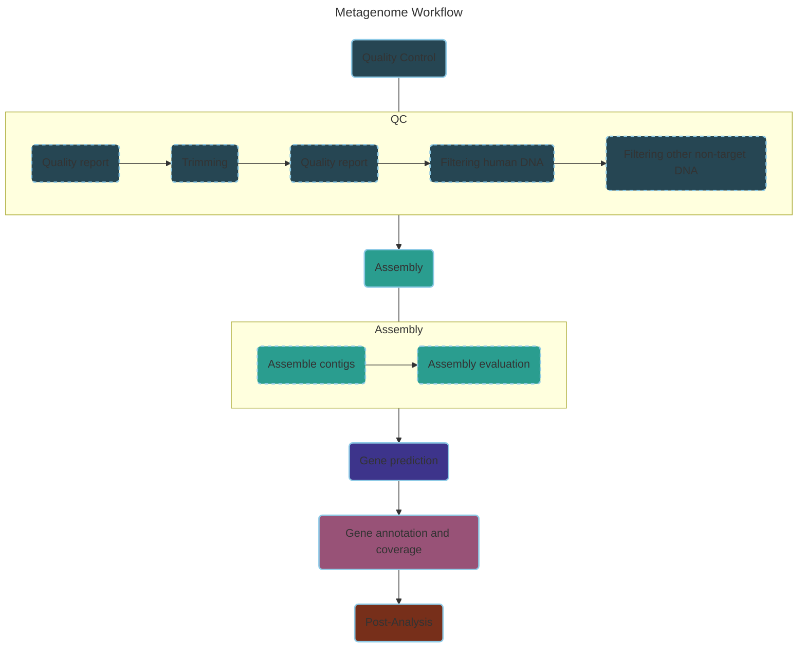

# kauri-soil-shotgun

## Workflow outline

```mermaid
---
title: Metagenome Workflow
---

 flowchart TD;
 
    step1(Quality Control)
        step1a(Quality report)
            %%prog1a(FastQC)
        step1b(Trimming)
            %%prog1b(BBDuk)
        step1c(Quality report)
            %%prog1c(FastQC)
        step1d(Filtering human DNA)
            %%prog1d(BBMap)
        step1e(Filtering other non-target DNA)
            %%prog1e(Kraken2)
    step2(Assembly)
        step2a(Assemble contigs)
        step2b(Assembly evaluation)
    step7(Gene prediction)
    step8(Gene annotation and coverage)
    step9(Post-Analysis)

style step7 fill:#3d348b,stroke:#8ECAE6,stroke-width:2px 
style step8 fill:#985277,stroke:#8ECAE6,stroke-width:2px 
style step9 fill:#772f1a,stroke:#8ECAE6,stroke-width:2px 

classDef one fill:#264653,stroke:#8ECAE6,stroke-width:2px
classDef onesub fill:#264653,stroke:#8ECAE6,stroke-width:2px,stroke-dasharray: 5 5
classDef two fill:#2A9D8F,stroke:#8ECAE6,stroke-width:2px 
classDef twosub fill:#2A9D8F,stroke:#8ECAE6,stroke-width:2px,stroke-dasharray: 5 5


%% Overall flowchart
step1:::one---QC-->step2:::two---Assembly-->step7-->step8-->step9


%% Subgraphs for more detail 
subgraph QC
    step1a:::onesub-->step1b:::onesub-->step1c:::onesub-->step1d:::onesub-->step1e:::onesub

end

subgraph Assembly
    step2a:::twosub-->step2b:::twosub
end

```
